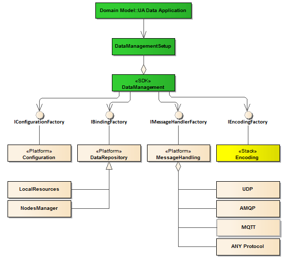
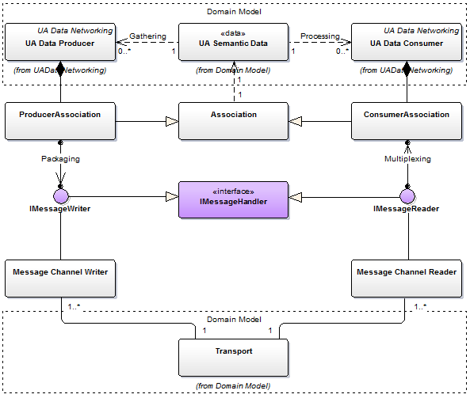

# Networking of SemanticData Library

## Introduction

This project is aimed to provide a library for Part 14 PubSub Draft 1.04. using the concept described in the [OPC UA Data Processing Outside the Server](../../SemanticDataSolution#opc-ua-data-processing-outside-the-server)

For more in-depth information about creating UA Applications exchanging data over the network, see [Getting Started Tutorial](./READMEGettingStartedTutorial.md#getting-started-tutorial)

The code is tested using the Unit Test located in the project: [Networking.SemanticData.UnitTest](../Networking/Tests/SemanticDatalUnitTest)

The preliminary code help documentation is here: http://www.commsvr.com/Download/DataManagement/Index.html

The project is in development stage - major changes are expected.

## Architecture

The library is designed to be a foundation for developing application programs that are parties of message centric communication pattern. The diagram presents relationship between the `DataMangement` library and other communication parties where the library is expanded to provide custom functionality.

![Architecture] (../../CommonResources/Media/DataManagementGeneralization.png)

In figure below the relationship between this library and external libraries is presented. Any application engaging the **DataManagemnet** is composed using the dependency injection pattern.

**Configuration** represents functionality needed to read the configuration and handle the configuration modification at runtime. This functionality must be supported by the deployment platform. The library described in the article [UA Data Networking Configuration](../UANetworkingConfiguration#ua-data-networking-configuration) provides helper classes that may be used to gather all required information from the configuration files to instantiate the communication infrastructure and start pumping the data.

In figure below the relationship of the internal implementation with the overall domain model is presented.

## Assumptions

* It is assumed that the data consumer is lightweight and may support limited encoding/decoding functionality. The functionality will be  provided as a plug-in library injected at run time. EncodingDecoding is recognizable using a pair of: name recovered from the Type object and OPC UA DataType represented by its URI.
* Data binding - it is assumed that the binding of Local repositories/variables and messages content items is provided by the configuration. It could be also provided at runtime by updating the configuration using any external mechanism.

### Bindings and encodings implementation ##

Binding between the local repository `DataRepository` (e.g. HMI Screen, OPC UA Server Address Space) and the message content items is provided by the `IBinding` interface and its basic implementation `Binding` class. This class is responsible to decode the data from the format used to construct the message to the local type. The decoders are factored by the external class `Encoding`. See definition for details: `IBinding`.
It is expected that the value conversion (decoding) is provided by an instance of the IValueConverter class. If it is not applicable the [Adapter patern](http://www.dofactory.com/net/adapter-design-pattern) must be used.

### Message Transport ##

Message Transport will not be implemented as the library part. This functionality must be injected form outside by implementing the interfaces:

* `IMessageHandler`: provides basic functionality handling messages communication over the wire.
* `IMessageReader`: provides functionality supporting reading the messages from the wire.
* `IMessageWriter`: provides functionality supporting sending the messages over the wire.

The library provides basic implementation of the above mentioned interfaces. In following diagram an implementation provided by the library is presented.

Hope is that the abstraction will support any types of message based communication layer.
The library provides basic implementation of the `Message` class that supports package level encoding/decoding functionality.

### Messages Sequence

## Testing

See how it works in the unit test class: [BindingUnitTest](../Tests/SemanticDatalUnitTest).

The [UA Data Example Application](../Networking/ReferenceApplication#ua-data-example-application) contains a reference WPF application.
